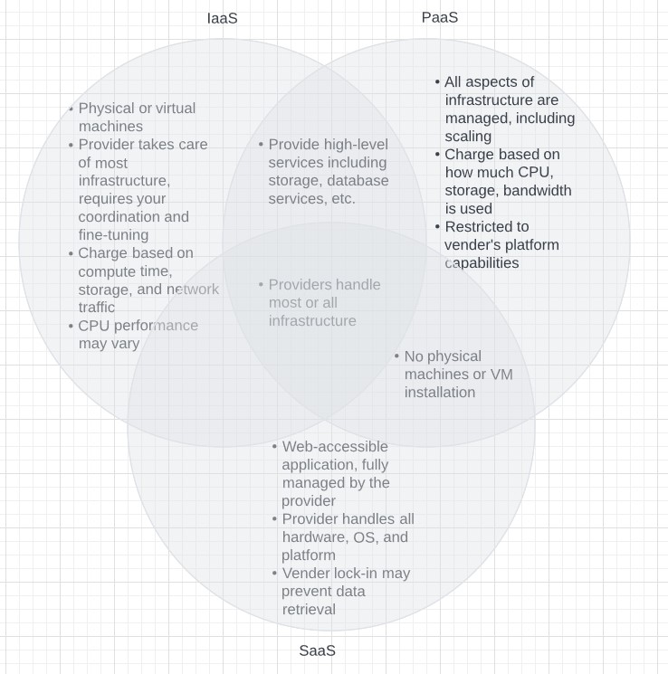

# Exercises - Chapter 03 Selecting a Service Platform

1. Compare IaaS, PaaS, and SaaS on the basis of cost, configurability, and control (hint make a chart)\

2. What are the caveats to consider in adopting Software as a Service?\
SaaS providers may have a practice called "vender lock-in" where they intentionally make it difficult for you to extrieve your data, likely to prevent you from leaving their service and move to another. SaaS providers may also update their products without warning, which prevents users from testing and training with new features. You should also be aware of data privacy concerns that exist between yours, your customers, and the SaaS'.

3. List the key advantages of virtual machines.\
Virtual machines are able to use a physical machine's stranded capacity which would otherwise go unused. Compared to physical machines, virtual machines are easy to use where creation, start, stop, modification, and destruction of the virtual machines are easily handled by software API. 

4. Why might you choose physical over virtual machines?\
Virtual machines may share certain resources with the physical machine and with other virtual machines, such as CPU cores and disk I/O bandwidth, which would impede performance. Virtual machines run their own operating systems on their own so they use and hold on to a lot of memory of the physical machine, even when not in use which prevents the memory will being reallocated elsewhere. The operating systems of the virtual machines also need resources to run their own background services.

5. Which factors might make you choose private over public cloud services?\
Utilizing a public cloud service means one's data and code are externally stored by a third-party which increases risk of malicious activity or data leaks. This also means if law enforcement wanted to access the data from the third-party, you may not be made aware. Since other parties also share the use of the public cloud service with you, your data may be leaked to those parties in the event of a leak. As such, privacy may be a big factor in the consideration between a private or public cloud. 